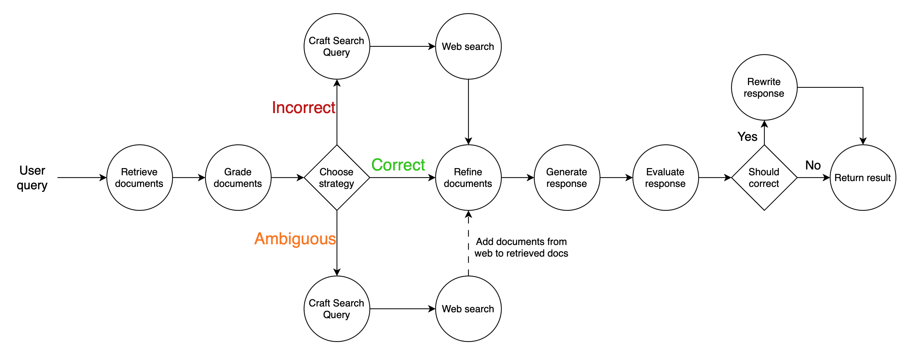

# CRAG-Based Game Lore Chatbot

This project implements a sophisticated chatbot for game lore analysis using the Corrective Retrieval-Augmented Generation (CRAG) methodology, based on the original [paper](https://arxiv.org/abs/2401.15884). The chatbot leverages a powerful language model to answer questions about the world of Teyvat from Genshin Impact, with a robust system for retrieving and validating information.



## Overview

The application is built with a stateful, graph-based agent that processes user queries through a series of steps:

1.  **Retrieve:** Fetches relevant documents from a Chroma vector database.
2.  **Grade:** Assesses the relevance of each document to the user's question.
3.  **Corrective Generation:** If documents are insufficient, it formulates a new search query to gather more accurate information from the web.
4.  **Refine:** Compresses and distills the retrieved information to isolate the most critical context.
5.  **Generate:** Produces a final answer, which is reviewed against predefined ethical and content principles to ensure a high-quality, polite, and on-brand response.

## Getting Started

Follow these instructions to set up and run the application locally.

### Prerequisites

- Python 3.10+
- An OpenAI API key
- A Tavily API key

### Setup

1.  **Clone the repository:**
    ```bash
    git clone https://github.com/your-username/GenshinImpactLore.git
    cd GenshinImpactLore
    ```

2.  **Install dependencies:**
    ```bash
    pip install -r requirements.txt
    ```

3.  **Set up environment variables:**
    Create a `.env` file in the root directory by copying the example file:
    ```bash
    cp .env_example .env
    ```
    Open the `.env` file and add your API keys:
    ```
    OPENAI_API_KEY="your-openai-api-key"
    TAVILY_API_KEY="your-tavily-api-key"
    ```

### Usage

To run the chatbot, use the following command:

```bash
chainlit run app.py
```

This will start a local web server, and you can interact with the chatbot in your browser.

## Technology Stack

- **LangGraph:** For building the stateful, graph-based agent.
- **LangChain:** For AI orchestration, including chains, document processing, and output parsing.
- **Chroma:** For the vector database to store and retrieve lore documents.
- **Tavily:** For real-time web searches to augment the knowledge base.
- **Chainlit:** For creating the interactive chat interface.
- **OpenAI:** For the underlying language model (`gpt-4o-mini`).
- **Sentence-Transformers:** For generating embeddings.

## Robustness and Guardrails

To ensure the reliability and quality of the chatbot's responses, several mechanisms are in place:

- **RetryWithErrorOutputParser:** Guarantees that the model's output can be parsed correctly, with a retry mechanism to handle any formatting errors.
- **Constitutional AI:** Enforces content policies to maintain a consistent and appropriate tone. The agent adheres to two main principles:
    - **Ethical Principle:** Ensures all responses are polite and respectful.
    - **Game Image Principle:** Prevents negative commentary about the Genshin Impact game itself, maintaining a positive brand image.

These guardrails make the chatbot's output more robust, both in its structure and content.
